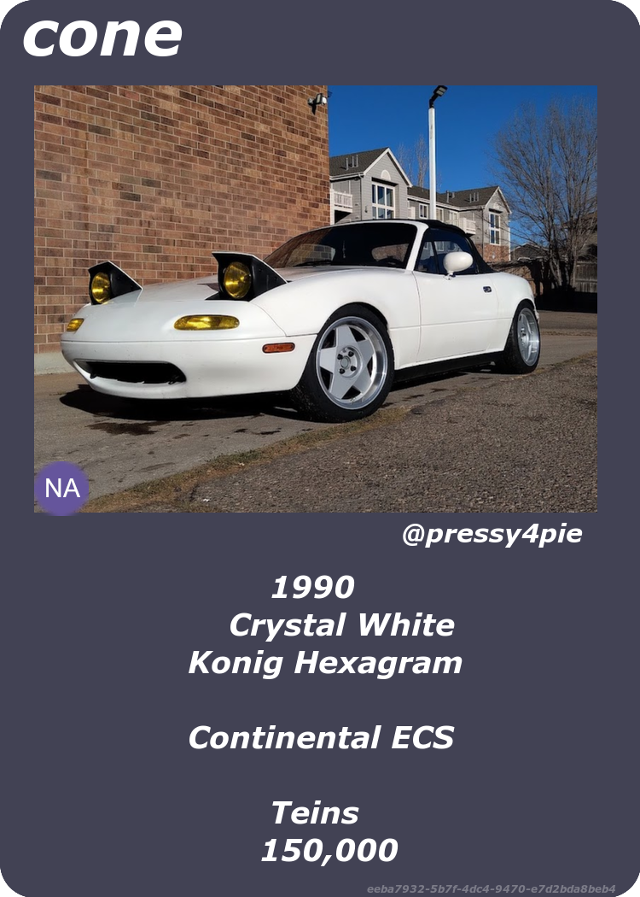

# Trading Card Builder

WIP virtual trading card game builder and engine.
See [notes.md](notes.md) for ideas and ramblings
of what I want this to be in the end.

## TODO

- [x] Elixir interface to building databases
- [x] test for elixir interface
- [ ] Web application using Elixir interface
- [x] Zig engine to render cards
- [ ] Embed engine in Elixir service
- [ ] Embed engine in Flutter app?
- [ ] Tests for engine
- [ ] Card transfering/trading
- [ ] Card gifting
- [ ] "special" card rendering / gif output
- [ ] CLI applications for both Zig and Elixir interface
- [ ] test for crypto functions

## Simple Example

The "main" photo:


add an icon to overlay with a unique badge:


The background image to use:


The code that puts it all together:

```lua
local Card = {};
Card.VersionMajor = 0;
Card.VersionMinor = 1;

Card.Photo = loadImg("coneborb.png")
Card.Background = loadImg("bg.png");
Card.Icon = loadImg("icon.png");

Card.PrimaryTitle = "cone";
Card.SubTitle = "@pressy4pie";
Card.Body = [[
        1990
    Crystal White
Konig Hexagram

Continental ECS

        Teins
       150,000
]];

return Card;
```

And finally the card it outputs:


